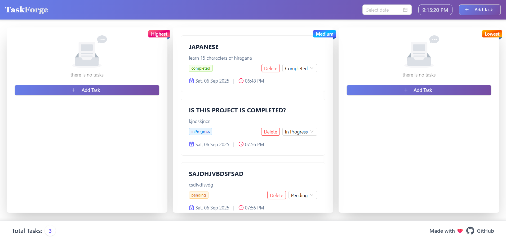
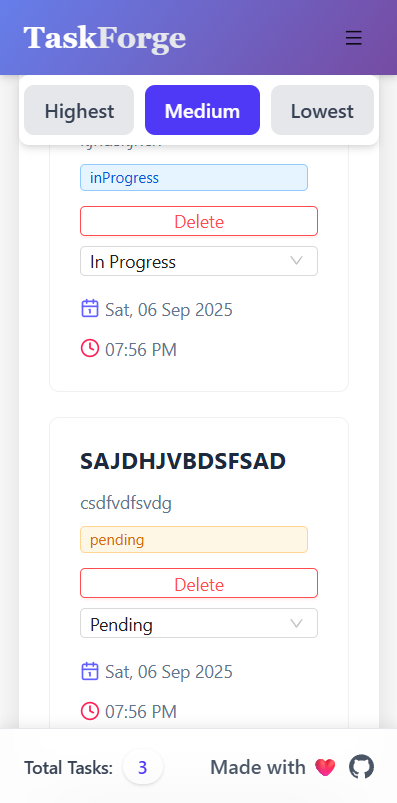

---

# 📝 TaskForge – A Modern Task Management App

A **responsive and elegant task planner** built with **React, Zustand, Tailwind CSS, and Ant Design**.
It helps you manage your tasks by **priority (Highest, Medium, Lowest)**, track their status, and stay productive.

---

## 🚀 Features

✅ **Add, update, and delete tasks**
✅ **Priority-based columns** (Highest, Medium, Lowest)
✅ **Task status management** (Pending, In Progress, Completed)
✅ **Responsive design** –

* **Desktop**: Kanban-style 3 columns
* **Mobile**: Tab-style view with priority filters
  ✅ **Beautiful UI** using Ant Design + Tailwind
  ✅ **Modal form** for adding new tasks
  ✅ **Expandable “Read More” modal** for long descriptions
  ✅ **Live clock** in the navbar
  ✅ **Persistent state management** with Zustand
  ✅ **Footer with task count + GitHub link**

---

## 🖼️ Screenshots

### 🖥️ Desktop View (3-column Kanban style)



### 📱 Mobile View (Tabbed priorities)



---

## 🛠️ Tech Stack

* ⚛️ **React** – Frontend library
* 🎨 **Tailwind CSS** – Utility-first styling
* 🧩 **Ant Design (antd)** – UI components (Modal, Button, Card, Select, etc.)
* 📦 **Zustand** – Lightweight state management
* ⏰ **Moment.js** – Date & time formatting
* 🎭 **Lucide Icons** – Modern icons

---

## 📂 Project Structure

```
planner-app/
│── src/
│   ├── components/
│   │   ├── AddTaskButton.jsx
│   │   ├── FormModal.jsx
│   │   ├── layout/
|   |   |     |--NavBar.jsx
|   |   |     |--Footer.jsx
│   │   ├── TaskColumn.jsx
│   │── store/
│   │   ├── usePlanner.js
│   ├── App.jsx
│   ├── index.css
│   ├── main.jsx
│── package.json
│── tailwind.config.js
│── README.md
```

---

## ⚡ Installation & Setup

Clone the repository:

```bash
git clone https://github.com/Adit122022/React_100_Days.git
cd React_100_Days
cd 05_ZustandReactTask
```

Install dependencies:

```bash
npm install
```

Start the development server:

```bash
npm run dev
```

Open your browser at **[http://localhost:5173](http://localhost:5173)** 🎉

---

## 🎯 Usage

1. Click **➕ Add Task** in the navbar or drawer menu.
2. Fill in the **Title, Description, and Priority**.
3. Manage tasks by:

   * Changing **status** (Pending → In Progress → Completed)
   * Deleting tasks
   * Expanding **long descriptions** with "Read More"
4. Track total tasks in the footer.

---

## 📱 Responsive Design

* **Desktop:**

  * Displays all three priority columns side by side.

* **Mobile:**

  * Shows **tabs (Highest | Medium | Lowest)**.
  * Displays only the selected priority’s tasks.

---

## 🌟 Future Enhancements

* 🔐 Authentication (Login/Signup)
* ☁️ Save tasks to a database (MongoDB / Firebase)
* 📅 Due dates & reminders
* 🔎 Search & filters
* 📊 Task statistics dashboard

---

## 👨‍💻 Author

**Aditya Sharma**

* 🌐 [GitHub](https://github.com/Adit122022)
* 💼 Aspiring Web Developer | MERN Enthusiast

---

## 📜 License

This project is licensed under the **MIT License** – free to use and modify.

---

⚡ *Planner App – Stay productive, stay organized!*

---

